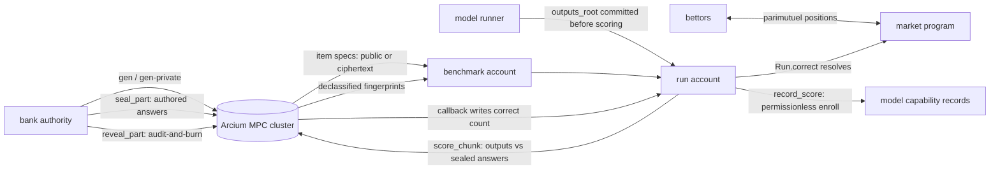

# Sealed

[](https://github.com/josepha-mayo/sealed/actions/workflows/ci.yml)
[](https://josepha-mayo.github.io/sealed/)

**A benchmark whose answer key was never written down, scored by nobody in particular.**

Sealed is a referee for AI-capability claims. Benchmark items can be **minted inside the MPC cluster itself** — drawn from `ArcisRNG`, answered and fingerprinted in-circuit, and stored encrypted to the cluster key. The answer key never exists in plaintext anywhere on Earth: there is nothing to leak, sell, or subpoena. Models are scored inside an [Arcium](https://arcium.com) MPC cluster; the score is written to Solana by the cluster's callback, not by us. Anyone can build a market on "does model X clear 70% on Sealed v1 by date D" and settle it without trusting a leaderboard operator.

Built for Colosseum's Crypto World's Fair (Sep 14 – Oct 12, 2026).

[](https://github.com/josepha-mayo/sealed/actions/workflows/ci.yml)
[](https://josepha-mayo.github.io/sealed/)

> **Judging?** Start at [docs/judges.md](docs/judges.md) — a 10-minute path mapped to the rubric. **Live explorer: [josepha-mayo.github.io/sealed](https://josepha-mayo.github.io/sealed/)** — renders every bank, run, market, and Merkle proof straight from the committed on-chain snapshot, then **re-audits it in your browser**: every account's PDA re-derived, every `items_root` fold replayed bit-exact, every market resolution re-computed — no localnet, nothing trusted. With `arcium localnet` running, `scripts/demo.sh` runs the whole flow end-to-end.
>
> **Verify the whole submission in ~60 seconds** (clone → three commands → every claim recomputed):
>
> ```bash
> yarn install --frozen-lockfile
> node scripts/verify.mjs            # 12 PASS / 0 FAIL — the entire ledger re-derives offline
> node scripts/rescore.mjs --bank docs/evidence/calibration/bank.json \
>   --run docs/evidence/calibration/run-artifact.json \
>   --benchmark CSnhf6QySv3BszDkJ47KGooUx86PBpLxxi2iDz42S8fp \
>   --snapshot web/snapshot.json     # 7 PASS / 0 FAIL — the MPC's own arithmetic, reproduced
> yarn --cwd packages/harness cli chain tour --snapshot web/snapshot.json
>                                  # the project demos itself: stats → a run's custody
>                                  # trail → its feed → a venue's book → an actor's P&L
> ```
>
> The second command is the one nobody else ships: plaintext answers for one deliberately-public bank are in the repo, so the script recomputes every answer fingerprint, checks them against the on-chain reveals, re-binds the run's commitment, and recounts — **bit-identical to what the enclave wrote**. The explorer's calibration card renders the same exam side-by-side for two models (7/32 vs 2/32) with per-item discrimination.


*([asciicast](docs/demo.cast) · [mp4](docs/demo.mp4) — the real `scripts/demo.sh` run, MPC waits capped at 2s)*


*([asciicast](docs/dark.cast) — the real `scripts/dark.sh` run: a dark commit-reveal market on an exam that was never published)*


*([asciicast](docs/flagship.cast) — live commands on the evidence ledger: the 4-model leaderboard, `result_mask=0b11` paying both co-leader backers, the dark market on a ciphertext-only bank, and `verify.mjs` re-deriving every account + replaying every resolution)*

## Why

Prediction markets on AI progress settle against leaderboards run by single companies, and lab-reported benchmark numbers are unverifiable and increasingly contaminated by training data. There is no neutral referee. Sealed makes the referee a protocol:

| Property | How |
|---|---|
| Questions are never published | Only a Merkle root of salted question commitments goes onchain (`Benchmark.items_root`). Retired items are revealed with their salt and checked against the root. |
| Answers are never in plaintext onchain | Answer hashes are encrypted by the author, then **re-encrypted to the MXE key inside MPC** (`seal_part`). After sealing, the author's key is discarded and the stored ciphertext can only be opened by the cluster acting together. |
| **No answer key at all** | Generated banks (`chain gen`) mint items **inside MPC**: `gen_part` draws specs from `ArcisRNG`, computes answers in-circuit, fingerprints them (SHA3-256), and returns them encrypted to the MXE key. Only the public item specs land onchain. There is no answer key — nothing to leak. |
| **No questions OR answers onchain** | Private generated banks (`chain gen-private`) go further: `gen_part_private` returns the specs as `Enc<Shared, Pack<GenPart>>` to the authority's x25519 key (derived from their Solana keypair — no extra key management). `PrivItemChunk` accounts hold ciphertext only; `items_root` commits to the ciphertext itself, so the mint transcript is auditable by anyone while the questions stay confidential to the authority. Neither the questions nor any answer key exists in plaintext. |
| Scores are not posted by the operator | `score_chunk` compares a run's public output hashes with the sealed answers in MPC and reveals only the count. The Arcium callback writes it to the `Run` account. |
| Scores are auditable without a key | `reveal_part` lets the benchmark authority declassify one part's answer *fingerprints* (hashes, never plaintext). `chain verify` then checks them against a run's committed output hashes — a spot-check of what `score_chunk` counted, mediated by MPC so even the authority only ever sees hash commitments. |
| Questions are shareable without publishing | `reshare_part` re-encrypts a private bank's specs to a *second* viewer key inside MPC — the authority can hand a judge, runner, or panel the exam questions without ever putting them onchain. Grants land in per-(chunk, part, viewer) PDAs; disclosure is one-directional (the authority's own key cannot open the delegate's grant), and answers never move. |
| Runs are commitments | A run commits to the Merkle root of all its output hashes before any chunk is scored, and every scored chunk's hashes are permanently in the transaction record. A bad run cannot be retracted. |
| Per-item results stay hidden | Only aggregate counts leave the circuit, so a run cannot be used to leak the answer to a specific item. |

## Architecture



The market program reads `Run.correct` only — it never sees items, answers, or ciphertext. Six primitives settle on that one number: score-band, duel, ladder race, unseen-exam, dark commit-reveal, capability bounty. A `record_score` instruction then folds any finalized run into a persistent `ModelRecord` — a per-model cumulative artifact keyed by `sha256(model_id)` — with a `ScoreLog` receipt PDA making each run countable exactly once. Anyone can enroll a finalized run; the aggregate is what a leaderboard was supposed to be, minus the operator. [docs/integrate.md](docs/integrate.md) is the consumer guide — the owner+discriminator gate, the `post_reveal` tail-read, the honesty flags a resolver must respect, and the PDA seeds for `Run`/`ScoreLog`/`ModelRecord`, so a third-party venue composes on `Run.correct` with no CPI and no trust in us.

Per-account detail:

```
packages/harness (TypeScript)            programs/sealed (Anchor)         encrypted-ixs (Arcis, runs in MPC)
------------------------------            ------------------------         ----------------------------------
authored bank (kind=0):
buildBank(seed) -> prompts, answers  --> create_benchmark(items_root, kind)
  answerHash = SHA256(...)[0..8]     --> init_chunk / stage_part (8 items)
  encrypt(RescueCipher, x25519)      --> seal_part  -------------------->  seal_part: Enc<Shared> -> Enc<Mxe>
                                         seal_part_callback <------------  (ciphertext stored in AnswerChunk)

generated bank (kind=1):               create_benchmark(kind, root=0)
                                       init_chunk + init_items
                                       gen_part ----------------------->  gen_part: specs <- ArcisRNG;
  specs land public in ItemChunk          gen_part_callback <------------   answers hashed + Enc<Mxe> born
  items_root = running spec fold                                        (no answer key ever exists)

private bank (kind=2):                 create_benchmark(kind, root=0)
                                       init_chunk + init_items_private
                                       gen_part_private(viewer_pub) --->  same, but specs return
  specs land as ciphertext in             gen_part_private_callback <--    Enc<Shared, Pack<GenPart>>
  PrivItemChunk; items_root folds the     (ciphertext stored; only the
  ciphertext itself                        authority can decrypt)
                                       reshare_part(viewer_pub) ------->  reshare_part: decrypt specs in
  ShareGrant PDA <- delegate decrypts      reshare_part_callback <-----    enclave, re-encrypt to delegate
  with their own wallet key              (selective question disclosure)

runModel(model) -> outputs[]         --> create_run(outputs_root, fee)
  canonicalAnswer -> hash            --> score_chunk(outputs[32]) ------>  score_chunk: count(outputs == 4 sealed parts)
                                         score_chunk_callback <----------  reveals only the count
                                         Run.correct += count; finalized when all chunks scored
```

- **Items** are procedural, exact-answer tasks. **Authored banks** (kind 0) draw ten families (arithmetic chains, stack-machine programs, list transforms, Caesar shifts, base conversion, grid walks, gcd/lcm, digit sums, calendar arithmetic, word sorting) from a master seed — infinite and fresh by construction. **Generated banks** (kind 1) mint arithmetic-expression items inside MPC; anyone can render the prompts from the public specs, but the answer fingerprints were computed and sealed inside the enclave — *no answer key ever existed*.
- **Canonicalization** (`canonical.ts`) is the only normalization applied to a model's reply before hashing; author and runner use the same function.
- **Chunks** are 32 items, stored as 4 parts of 8. Sealing is per part because an MPC callback must fit in one Solana transaction (8 ciphertexts = 256 B; 32 would not). Scoring reads all 4 parts in one computation, so a run over a 10-chunk (320-item) bank is 10 MPC computations.
- **Fee**: `create_run` pays `Benchmark.fee_lamports` to the benchmark authority. That is the business.

### Markets (`programs/market`)

A second Anchor program hosts N-way parimutuel markets on a run's final score, whose resolution input is a Sealed `Run` account — no oracle operator, no admin key deciding outcomes. It ships six settlement primitives: **capability bounties** (a sponsor escrows SOL against "first run to score ≥ T on this bank" — the pot pays the winning run's *operator*, not a bettor; FCFS with a retroactivity wall, sponsor self-claim rejection, and permissionless expiry refunds, `scripts/bounty-local.sh`), **run duels** (head-to-head "does A outscore B" on the same bank — bets latch the moment either leg's first scoring computation queues, `RunnersMustDiffer` blocks self-duels), **ladder races** (K-way argmax markets over 3–8 bound runs — co-leaders split the pot dead-heat, legs that land nothing forfeit at 0 instead of cancelling, and bets latch the moment *any* leg leaves pending), **unseen-exam markets** (a market opens and fills on a private-bank run — the event being priced is itself confidential: questions are ciphertext-only before, during, and after settlement, `scripts/unseen.sh`), **dark commit-reveal markets** (a bettor's side is a `sha256` commitment — sealed until they choose to reveal; no-show winners forfeit into the pot and a zero-reveal market refunds everyone, `scripts/dark.sh`), and **committed-settle expiry** (`all_queued_at` + a 24h landing window — a stalled run refunds unless the runner committed every chunk and the cluster had a full window to land it; no transaction can both commit and expire).

```
create_market(run, salt, edges, fee_bps, closes_at, resolve_by)
                                  open while run is pending and unscored
                                  (scored_mask == 0 && pending_since == 0 —
                                  once scoring is ever queued, markets on
                                  that run stay closed permanently).
                                  edges=[t] is a binary market; edges=[10,20,40] makes 4
                                  score buckets (strictly increasing, no duplicates).
                                  fee_bps <= 1000 (10% max) skimmed at resolution;
                                  closes_at optional (0 = until scoring starts);
                                  resolve_by REQUIRED — every market carries a
                                  permissionless refund deadline (max now+90d).
create_duel(run_a, run_b, salt, fee_bps, closes_at, resolve_by)
                                  head-to-head on the same benchmark: does A
                                  outscore B? 3 outcomes — A wins / B wins / tie
create_ladder(legs[3..8], salt, fee_bps, closes_at, resolve_by)
                                  K-way race on one benchmark: highest score
                                  takes the pot; ties split dead-heat pro-rata.
                                  closes_at REQUIRED (the leg list is public).
                                  A leg that never scores forfeits at 0 — dead
                                  legs never cancel the race (a cancel would be
                                  a free exit for losing leg operators). Bettors
                                  should verify every leg has a live runner.
bet(outcome, lamports)            stake on one bucket; one position PDA per (market, bettor).
                                  Rejects once scoring starts, closes_at passes, or
                                  resolve_by passes.
bet_duel(outcome, lamports)       same, but closes once EITHER run starts scoring
resolve()                         permissionless once run.status == FINALIZED:
                                  outcome = the bucket containing run.correct.
                                  Markets with any unbacked bucket cancel (refunds).
resolve_duel()                    permissionless once BOTH runs are FINALIZED:
                                  outcome = larger correct (ties pay the tie bucket);
                                  resolved_score packs (a << 16) | b
resolve_ladder()                  permissionless once every leg is terminal
                                  (finalized or proven stall) — a never-queued
                                  leg doesn't block, it scores 0. Past resolve_by
                                  anyone forces it, but a leg inside its
                                  post-commit landing window still gets the
                                  window (same JIT-commit invariant as expire).
claim()                           winners split the pot net of fee pro-rata and the
                                  position closes; cancelled markets refund in full;
                                  losing positions close for their rent back
claim_fee()                       authority collects fees_accrued once resolved; safe
                                  to call before bettors claim (fee is recomputed
                                  from fee_bps at each claim, so solvency never
                                  depends on claim order)
void_market()                     authority cancels — only while the run is still
                                  pending AND unscored (no free-look cancels)
expire_market()                   permissionless cleanup once resolve_by passes —
                                  never-queued/uncommitted runs refund in full; a
                                  run that committed every chunk AND stalled past
                                  its 24h landing window settles on the proven
                                  partial score; NOT callable once finalized
```

The `Run` account is verified by owner (`SEALED_PROGRAM`) + discriminator and deserialized inside `resolve`, so the settlement source is the MPC-scored field itself. Betting closes the moment the first scoring computation is queued — before that, all a bettor can see is the model id and the committed `outputs_root`.

### Trust model (honest version)

- The item author knows the answers to the items they wrote — **authored banks only**. Generated banks eliminate this role entirely: specs are drawn from `ArcisRNG` inside the cluster and the answers are born as MXE ciphertext. Honest caveat: *public* generated specs are public, so answers are computable by anyone who renders the items — the property they buy is *provable freshness and zero key custody* (nothing to leak, no author to collude with), not answer secrecy at inference time. **Private** generated banks close that gap: the specs never leave MPC unencrypted, so only the authority can render the prompts — at the cost of trusting the authority not to publish them (they hold the questions; the answers remain MXE-sealed and computable only by the cluster). For authored banks, secrecy comes from the author; sealing means no one *else* can ever read them.
- The runner controls what outputs it submits. Today the venue runs public model APIs itself; third-party runners get a TEE-attested harness or redundant runs from independent runners.
- Aggregate-only reveal plus a per-run fee bounds adaptive probing of individual answers.

### Hard problems this actually solves

The interesting engineering is where markets meet MPC timing — each of these
was found by adversarial review and is covered by a test or live artifact:

- **Callback races**: Arcium callbacks land asynchronously, so a bettor could otherwise commit outputs or expire a market inside the gap between the last queue and the landing callback. Runs carry a per-chunk landing window (`all_queued_at`); commit and expiry both respect it.
- **N-way fairness**: ladder races resolve by argmax with a dead-heat bitmask (co-leaders split pro-rata), and the mask is `u16` — the naive `u8` truncates the 8th leg to zero (regression-tested, proven live on an 8-leg race).
- **Hidden positions**: dark markets carry only `sha256(domain ‖ market ‖ bettor ‖ outcome ‖ amount ‖ salt)` — the bet tx reveals nothing; winners disclose inside a bounded reveal window and no-shows forfeit into the pot.
- **Audit vs integrity**: declassifying fingerprints for a spot-check publishes the exact scoring targets — so reveal is permanent burn. `benchmark.reveal_count` → `post_reveal` → `PostRevealRun` is enforced by the programs, demonstrated live, and cross-checked by the verifier.
- **Freshness vs custody**: generated banks prove no answer key ever existed (answers are born as MXE ciphertext), while authored banks keep questions private but trust the author — three different trust levels, one interface.
- **Confidential delegation**: `reshare_part` re-encrypts specs to a delegate inside MPC so a judge or runner can be handed an exam — questions readable, answers still sealed — without the authority learning the delegate's key or vice versa.

## Repo layout

```
encrypted-ixs/          Arcis circuits: seal_part, score_chunk, gen_part, gen_part_private, reveal_part, reshare_part
programs/sealed/        Anchor program (Arcium MXE): registry, chunks, runs, callbacks
programs/market/        Anchor program: parimutuel markets resolving on Run.correct
packages/harness/       item generators, canonical hashing, model harness, chain client, CLI
web/index.html          leaderboard + proof explorer (single file, web3.js via CDN, reads any RPC)
tests/                  end-to-end test on Arcium localnet
scripts/                demo.sh (full judge demo), dark.sh (sealed-position market on a private bank), duel-real.sh (head-to-head on a fresh MPC-minted exam), duel-local.sh (two real local models duel — llama.cpp endpoints, zero external API), ladder-local.sh (four real models race — dead-heat + dark leg), dark-local.sh (double-sealed: dark market on a private exam's real-model run), band-local.sh (score-band on a sealed exam), bounty-local.sh (capability bounty: first-to-beat pot pays the winning run's operator, FCFS), real-bounty-claim.sh (a real open-weights model earning a bounty through MPC proof), unbrick-demo.sh (grief a PDA with dust → permissionless `unbrick_pda` reclaim → init lands), record-local.sh (real local model → MPC score → `record_score` enrolls it in the on-chain capability registry), cu-sweep.sh + measure-cu.mjs (per-instruction compute-unit table in docs/costs.md), merge-snapshot.mjs (fold a post-wipe ledger's accounts into the committed evidence snapshot), serve-local.sh (four llama.cpp endpoints), unseen.sh (market on a never-published exam), ladder8.sh (max-width race), real-unseen-run.sh (real model on a grant-only exam), localnet-up.sh (restart fallback), smoke-localnet.sh, setup-wsl.sh (toolchain), real-model-run.sh / real-gen-run.sh (real-model pipelines), score-artifact-insecure.mts, verify.mjs (offline cryptographic audit of the evidence snapshot — same suite runs in-browser on the hosted explorer), rescore.mjs (independent MPC-score recomputation on the calibration bank — plaintext answers public on purpose), audit-browser-test.mjs (headless regression for the in-page audit), decrypt-grants-test.mjs (offline regression for the explorer's in-browser ShareGrant decryption — runs the vendored RescueCipher against the committed snapshot), check-post-reveal.mjs (standalone F1 repro), verify-deployed.sh (dumps on-chain program bytes and sha256-compares them to the local build — "deployed" only counts when they match), check-submission.mjs (submission pre-flight + plaintext-leak scan over the tracked tree)
```

## Develop

Toolchain (Ubuntu 24.04 / WSL2): `scripts/setup-wsl.sh` installs Docker, Node 22, Rust, Solana CLI 3.1.10, Anchor 1.0.2 and Arcium.

```bash
yarn install
arcium build                      # circuits + program (+ .idarc callback types)
scripts/e2e.sh                    # build + `arcium test`: local 2-node MPC cluster, full seal/score flow
yarn harness:test                 # generators, canonicalization, Merkle, run pipeline (offline)
```

Harness CLI (`yarn --cwd packages/harness cli ...`):

```bash
sealed bank build  --seed "$SEALED_MASTER_SEED" --id 1 --chunks 10   # -> bank/1.json (private: prompts + answers)
sealed run         --bank bank/1.json --model openai/gpt-5.2         # -> runs/… (private: raw replies)
sealed run         --bank bank/1.json --model mock/oracle-0.6        # offline stand-in, 60% correct
sealed chain init                                                    # comp defs + circuit upload, once per deployment
sealed chain seal  --bank bank/1.json --fee-lamports 1000000         # authored bank: create, stage + seal every part
sealed chain gen   --id 7 --chunks 2 --fee-lamports 1000000          # generated bank: mint items inside MPC, no answer key
sealed chain items --benchmark <pubkey>                              # re-render a generated bank from onchain specs
sealed chain gen-private --id 8 --chunks 2 --fee-lamports 1000000    # private bank: specs encrypted to YOUR key
sealed chain pitems --benchmark <pubkey>                             # decrypt + render a private bank (authority only)
sealed chain reshare --benchmark <pk> --chunk <i> --part <p> --to <solana-pubkey>  # delegate the questions to a second key
sealed chain grant   --benchmark <pk> --chunk <i> --part <p>           # delegate-side: fetch + decrypt your grant
sealed chain grants  --benchmark <pk> | --viewer <pk>                  # who can see which parts — or "what can I see" per delegate
sealed chain delegate-bank --benchmark <pk> [--out bank.json]          # rebuild the whole bank from your grants
sealed chain score --bank bank/1.json --run runs/….json              # create_run + score every chunk in MPC
sealed chain score --bank bank/1.json --run runs/….json --create-only  # park the run pending (for a market)
sealed chain score --bank bank/1.json --run runs/….json --run-index 1  # score an existing run
                              [--authority <pubkey>]  # bank authority when the
                                                      # scoring wallet is a separate runner
sealed chain status --benchmark <pubkey> [--snapshot f]                # leaderboard from chain state (snapshot = offline replay)

sealed chain market board   [--json] [--snapshot f]                    # keeper surface: claimable bounties, resolvable/tallyable/sweepable venues
sealed chain market board   --snapshot web/snapshot.json              # same board replayed offline from the committed evidence bundle — keyless, no RPC
sealed chain market sweep                                           # executes every permissionless action the board lists
sealed chain market positions [--bettor kp.json]                    # your book: payable/refundable/live positions + est. payouts
sealed chain market open    --run <pubkey> --threshold 55            # binary: "score >= 55?"
sealed chain market open    --run <pubkey> --edges 40,55 --salt 1    # 3-way score bands, 2nd market
                              [--fee-bps 0..1000] [--closes-at +secs|ts] --resolve-by +secs|ts
                              # resolve_by required: 60s..90d from now; closes_at optional, same floor
sealed chain market duel    --run-a <pk> --run-b <pk> --resolve-by +86400  # head-to-head
sealed chain market bet     --market <pk> --outcome 1 --lamports 500000000 [--bettor kp.json]
sealed chain market bet     --market <pk> --side yes --lamports 500000000   # binary shorthand
sealed chain market resolve --market <pk>                            # settles off Run.correct
sealed chain gate qwen2.5-3b --min-pct 60 --vouched                  # capability gate over the registry (exit 0/1/2)
sealed chain gate qwen2.5-3b --min-pct 60 --bank <bank>              # the same policy scoped to one exam (pk or name)
sealed chain gate --all --min-pct 70 --min-runs 2                    # the registry filtered by policy — who clears, ranked
sealed chain history qwen2.5-3b                                      # trajectory: every receipt, running accuracy
sealed chain compare qwen2.5-3b-instruct qwen2.5-1.5b-instruct         # head-to-head on shared banks (exit 0/1/2)
sealed chain compare --all                                           # paired-evidence leaderboard — W-L-T, disjoint pairs unranked
sealed chain trail <run-pk>                                          # custody chain — every venue that priced it, resolutions re-verified
sealed chain market bounties                                         # runner index — open bounties by pot, claimable marked honestly
sealed chain market venue <pk>                                       # one venue — pools, positions, keeper state, resolution re-verified
sealed chain market position <pk> --snapshot web/snapshot.json        # one position — stake, payout class (PAYS/REFUND/FORFEIT), exact claim cmd
sealed chain market quote <venue> --outcome <i> --lamports <n>        # bet simulator — payout/ROI/implied-share before you transact
sealed chain market odds [venue]                                     # what the stakes believe — implied probabilities + decimal odds
sealed chain market sentiment                                        # the stakes' per-model ranking — stake-weighted win%/score vs evidence
sealed chain market champions                                        # the settlement record — duel W-D-L · ladder leg wins · bounty claims
sealed chain market divergence                                       # evidence rank vs conviction rank — where money disagrees with receipts
sealed chain market calibration                                      # closing-book report card — favorite hit-rate + Brier vs uniform
sealed chain model <pk|model_id>                                     # the fused dossier — registry · evidence · settlement · belief · runs
sealed chain matrix [--banks N]                                      # the capability grid — models × most-run banks, best score per cell
sealed chain search <pk> --snapshot web/snapshot.json               # universal resolver — what IS this key? routes to the right dossier
sealed chain tour --snapshot web/snapshot.json                      # the project demos itself — stats → trail → feed → book → P&L → sentiment in one pass
sealed chain market claim   --market <pk> [--bettor kp.json]
sealed chain market void    --market <pk>                            # authority cancels, pre-scoring only
sealed chain market expire  --market <pk>                            # anyone, once resolve_by passes (not if finalized)
sealed chain market claim-fee --market <pk>                          # authority collects the accrued fee
sealed chain market show    --market <pk>
sealed chain market ladder open --legs <pk,pk,..> --closes-at +86400 --resolve-by +172800  # 3–8-way race
sealed chain market ladder bet|resolve|claim|void|claim-fee|show      # argmax settle, dead-heat splits
sealed chain market dark open  --run <pk> --threshold 20 --resolve-by +86400 [--reveal-secs 86400]
sealed chain market dark bet|reveal|resolve|finalize|claim|void|expire|claim-fee|show
                                                                     # commit-reveal: outcomes sealed
sealed chain reset-sealing  --bank-id <n> --chunk <i>                # clear a part stuck by a dropped MPC computation
sealed chain reset-pending  --run <pk> --chunk <i>                   # sweep a stuck scoring bit (stale = anyone)
sealed chain attest        --run <pk>                                 # authority pins an attestation flag on a finalized run
sealed chain record        --run <pk>                                 # enroll a finalized run into the persistent capability registry (anyone)
sealed chain modelrec      <pubkey|model_id>                          # show a model's aggregate record
sealed chain record --all [--watch s]                                # enroll EVERY finalized run — librarian daemon with --watch
sealed chain records                                                  # the whole registry, accuracy-first
sealed chain banks                                                    # every benchmark — kind, items, runs, best score
sealed chain bank <pk|name>                                           # one bank's dossier — spec, runs, venues, reveals
sealed chain wallet <pk>                                              # one address's footprint — banks, runs, venues, positions, grants
sealed chain stats                                                    # the dashboard — counts, escrow, and two bit-exact verdicts
sealed chain feed [--limit N] [--type a,b] [--pk k] [--model id] [--bank b]           # the activity stream — the ledger's chronology in one list
sealed chain watch [--interval s] [--type a,b] [--model id] [--bank b] # the live pulse — feed events as they land (snapshot = replay ticker)
sealed chain runs [--bank b] [--model m] [--min-pct n] [--status s] [--attested] # the run substrate — who scored what where
sealed chain reveal  --benchmark <pk> --chunk <i> --part <0..3>      # authority declassifies 8 answer fingerprints
sealed chain verify  --benchmark <pk> --run <file> [--run-index n]   # audit revealed hashes vs committed outputs
sealed prove                --run <file> --item <i>                # Merkle proof that output i was committed pre-scoring
```

The explorer's **verify-an-output** widget recomputes the Merkle path in-browser and checks it against the run's onchain `outputs_root` — cryptographic evidence that a model's claimed answer was in the committed set.

Explorer: serve the repo root (`python3 -m http.server -d . 8788`) and open `http://localhost:8788/web/?rpc=<url>` — defaults to localnet `http://127.0.0.1:8899`; offline, load the committed dump via `?snapshot=/docs/evidence/snapshot.json` or the file picker; on devnet it links out to explorer.solana.com.

Chain commands read `ANCHOR_PROVIDER_URL`, `ANCHOR_WALLET` and `SEALED_CLUSTER_OFFSET` (localnet: 0, devnet: 456; `ARCIUM_CLUSTER_OFFSET` works as a fallback when running inside the `arcium` env). `scripts/smoke-localnet.sh` runs the whole pipeline against a running `arcium localnet`.

Model calls go through any OpenAI-compatible endpoint (`SEALED_API_BASE`, `SEALED_API_KEY`; defaults to OpenRouter).

Docs: [judges.md](docs/judges.md) (10-minute path) · [api.md](docs/api.md) (instruction/circuit reference) · [circuits.md](docs/circuits.md) (line-by-line Arcis review guide) · [threat-model.md](docs/threat-model.md) (findings + residual assumptions) · [costs.md](docs/costs.md) (measured per-instruction CU table) · [integrate.md](docs/integrate.md) (compose on `Run.correct` + the capability registry — account layouts, PDAs, honesty flags) · [engineering-log.md](docs/engineering-log.md) (every hard failure + fix — the adversarial-review receipts) · [evidence/](docs/evidence/README.md) (snapshot + proof files) · [mainnet.md](docs/mainnet.md) (deploy runbook)

## Status

- [x] Circuits and program
- [x] Harness: generators, canonicalization, hashing, model client, run pipeline (tests green)
- [x] Localnet end-to-end: `arcium test` seals 2 chunks, scores a run (45/64 planted), finalizes
- [x] **Generated banks**: `gen_part` circuit mints items inside MPC — 4 comps mint a 32-item chunk, bank goes LIVE, specs public in `ItemChunk`, answers born `Enc<Mxe>`; E2E mint→live→score 17/32 planted, plus CLI `chain gen --id 77` -> mock run -> MPC score 24/32 == local pre-score
- [x] **Private generated banks**: `gen_part_private` mints the same items but returns them `Enc<Shared, Pack<GenPart>>` to the authority's x25519 key — `PrivItemChunk` holds ciphertext only, `items_root` commits to the ciphertext; E2E proves ciphertext-only onchain state, authority-side decrypt→render, wrong-key rejection, public-path `WrongBankKind`, and MPC score 21/32 planted + CLI `gen-private` → mock run → MPC score 23/32 == local pre-score
- [x] CLI pipeline on localnet: authored bank -> mock run -> MPC score 40/64, equal to the local pre-score (earlier epoch)
- [x] Real models through OpenCode Zen (earlier epoch, before Zen free-tier gating): ling-3.0-flash-fin-free 58/64 and nemotron-3.5-lightning-free 59/64, both MPC-scored on localnet with MPC == local pre-score
- [x] **Real models, no external API — every market primitive settled on a real MPC score**: FOUR open-weights models (two families) raced on an MPC-minted exam — `qwen2.5-3b` 6/32 **tied** `qwen2.5-1.5b` 6/32 (a real dead-heat, `result_mask=0b11` paid co-leader backers pro-rata), `llama-3.2-1b` 1/32, `qwen2.5-0.5b` 0/32 — with a dark commit-reveal market on leg 0 producing a live forfeit (`scripts/ladder-local.sh`, evidence `ladder-local.txt`). Also: `qwen2.5-1.5b` 3/32 vs `qwen2.5-0.5b` 1/32 duel `7p32UT6s…` (`duel-local.txt`); the 1.5b scored **8/32 on a private bank** read only through MPC reshare grants (`unseen-local.txt`); and the **double-sealed composition**: a dark market priced the 3b's pending run on a ciphertext-only exam while positions were themselves sha256-sealed (`dark-local.txt`), plus a full-book score-band market on the same sealed bank (`band-local.txt`). Real models make real mistakes — the benchmark measures, not flatters.
- [x] **Real model on an MPC-minted bank**: gpt-oss-20b (`openai` on Pollinations anonymous tier) answered all 64 items of generated bank 6932 — minted inside MPC, no answer key exists; MPC finalized **64/64 == local pre-score** (run `HW5H5bT7…`). Also 64/64 on authored bank 25864 (run `4uns99WD…`) — where a stale-bank artifact scored **1/64** (run `3CKnMa8X…`), proving the chain never trusts self-reported scores
- [x] **Delegated runner**: `chain delegate-bank` rebuilds a private bank entirely from a wallet's ShareGrants — verified byte-identical to the authority's decryption (prompts, answer hashes, items_root); a model provider can be granted the exam, run it, and get scored without the questions ever being public
- [x] Market program: N-way parimutuel resolved on `Run.correct` end-to-end on localnet — binary + 3-way score-band markets on one MPC-scored run, late-bet rejection, resolve reads `Run.correct`, winner paid
- [x] **Duel markets**: `create_duel`/`bet_duel`/`resolve_duel` — head-to-head "does run A outscore run B on the same bank?" with A-wins/B-wins/tie buckets; bets close once EITHER run starts scoring, settle reads both finalized `Run.correct`, E2E proves 25–19 resolution + pro-rata claim
- [x] **Ladder races**: `create_ladder`/`bet_ladder`/`resolve_ladder` — K-way argmax markets over 3–8 bound runs; dead-heat pro-rata ties, legs that land nothing forfeit at 0 instead of cancelling (a cancel would be a free exit for losing leg operators), any-leg betting latch + required `closes_at`; E2E proves a 30/20/10 race → mask `0b001` → pro-rata claim
- [x] **On-chain capability registry**: `record_score` permissionlessly enrolls a finalized run into `ModelRecord [modelrec, sha256(model_id)]` — cumulative totals, accuracy-first best run, first/last timestamps — while `ScoreLog [scorelog, run]` receipts make double-counting structurally impossible and snapshot the honesty flags (`attested`, `post_reveal`) at record time; the explorer renders the aggregate table and both audits replay every record bit-exact from receipts
- [x] **Independently recomputable MPC arithmetic**: `docs/evidence/calibration/` ships an authored 32-item bank with plaintext answers *public on purpose* — `scripts/rescore.mjs` recomputes every `answerHash` from plaintext, checks them against the on-chain `Reveal` accounts, re-binds the run artifact to `Run.outputs_root`, and recounts **7/32 — bit-identical to the MPC-written `Run.correct`**, fully offline. The enclave's math is reproduced, not trusted
- [x] Web: `web/index.html` single-file leaderboard + proof explorer + market board over any RPC — every open venue card carries a live **quote widget** (outcome + stake → est payout/ROI/implied share, the program's own parimutuel math in-page)
- [x] Output proofs: `sealed prove` + in-browser verifier against onchain `outputs_root`
- [x] Spot-check audit: `reveal_part` circuit + `chain reveal`/`chain verify` — authority declassifies answer fingerprints via MPC; E2E test confirms 8 declassified hashes equal the planted answers and non-authority reveals are rejected. Reveals are *burns*, enforced on-chain: a landed reveal bumps `benchmark.reveal_count`, later runs stamp `post_reveal=1`, and every market creator rejects flagged runs (`PostRevealRun`) — no stake can price a spoiled score
- [x] **Selective question disclosure**: `reshare_part` re-encrypts a private bank's specs to a delegate's x25519 key inside MPC — `ShareGrant` PDAs record who can see which parts; E2E proves the delegate decrypts items identical to the authority's, the authority's key cannot open the delegate's grant, non-authority reshares are rejected, and the suite salts bank ids per run so 17/17 tests pass on any ledger
- [x] Devnet: programs `FGVuEo…`/`8VSHkh…` deployed and **byte-verified** — `scripts/verify-deployed.sh` dumps each on-chain ELF and sha256-matches it against `target/deploy/*.so` (MATCH ×2; sealed 2026-10-03, market 2026-10-04). MXE on cluster 456, comp defs + circuits uploaded
- [ ] Devnet sealing: blocked on an Arcium devnet outage — cluster 456 finalizes computations but does not submit callback txs (`callbackTransactionsSubmittedBm=0`); `scripts/gen-devnet-retry.sh`/`seal-devnet-retry.sh` complete the flow automatically when it recovers

MIT.
